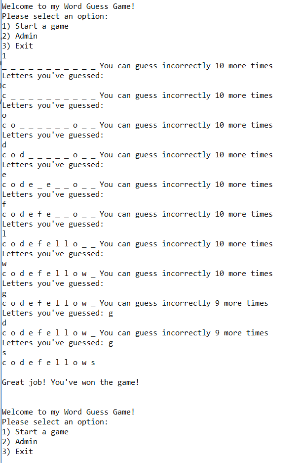
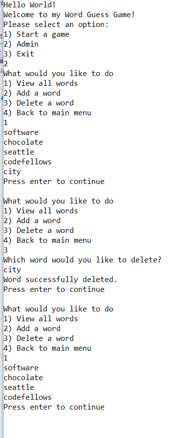

# Lab 03 - Word Guessing Game
A console application that allows the user to play a word guessing game. The player only gets 10 incorrect answers. The possible words are stored in a txt file that the player can view, add, or delete from.

## The Problem Domain
Josie Cat has requested that a “Word Guess Game” be built. The main idea of the game is she must guess what a mystery word is by inputting (1) letter at a time. The game should save all of her guesses (both correct and incorrect) throughout each session of the game, along with the ability to show her how many letters out of the word she has guessed correctly.

Each time a new game session starts, the mystery word chosen should come from an external text file that randomly selects one of the words listed. This bank of words should be editable by Josie so that she may view, add, and delete words as she wishes. She expects the game to have a simple user interface that is easy to navigate.

## Purpose
- To master the fundamentals of C# and to have fun

## How to run
### From the command line:
- git clone git@github.com:carloscadena/Lab03-WordGuessGame.git
- cd Lab03-WordGuessGame/Lab03-WordGuessGame
- dotnet run

## Visual Example
The program should look like the following:

